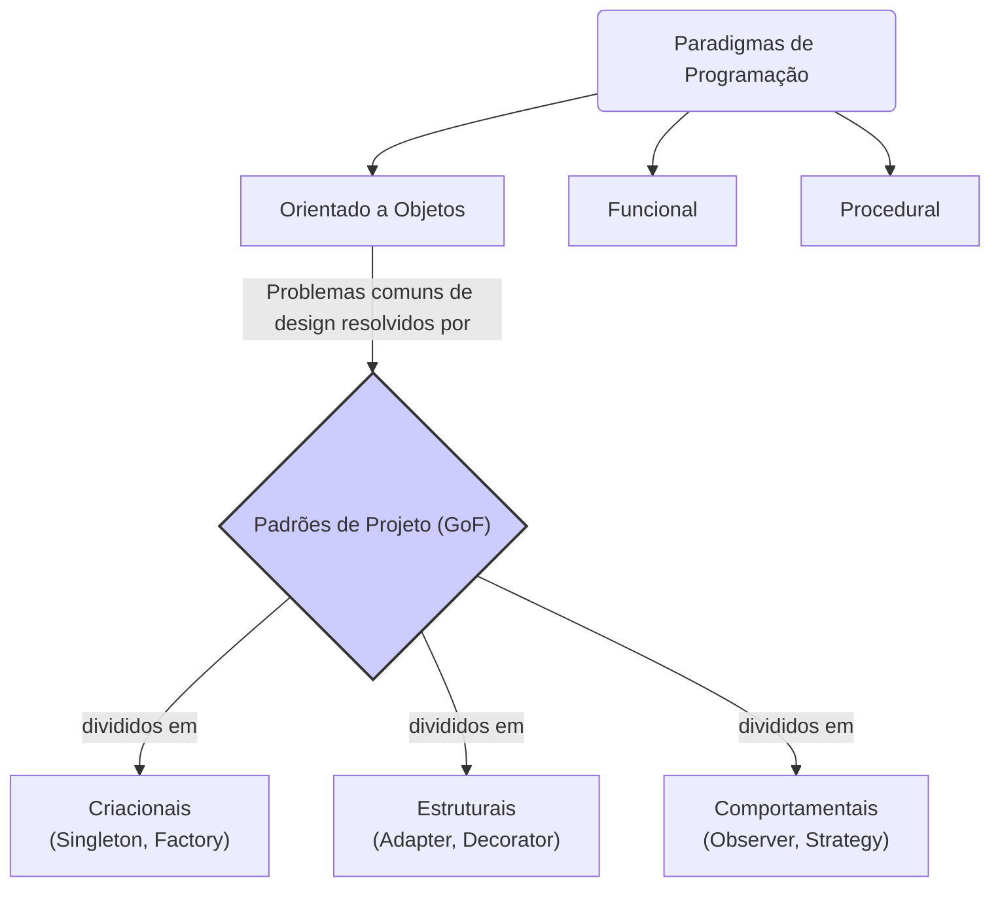

# 🧩 Paradigmas e Padrões: Estruturando o Pensamento e a Solução

No mundo da engenharia de software, **Paradigmas de Programação** e **Padrões de Projeto** são conceitos fundamentais que ajudam a estruturar o código, resolver problemas comuns e facilitar a comunicação entre desenvolvedores. Embora relacionados, eles operam em níveis de abstração muito diferentes.

### A Grande Diferença: Mapa vs. Rota

  - **Paradigma de Programação**: É o **mapa**. É uma filosofia, um estilo de programação de alto nível que dita a forma como estruturamos e pensamos sobre o código. Ele define as regras e os blocos de construção fundamentais. É o "como pensar".
  - **Padrão de Projeto (Design Pattern)**: É uma **rota específica no mapa**. É uma solução reutilizável, de baixo nível, para um problema comum que ocorre dentro de um determinado contexto. É o "como resolver um problema específico".

-----

## 🌍 Paradigmas de Programação: As Grandes Escolas de Pensamento

Um paradigma é uma maneira de classificar as linguagens de programação com base em suas características. A maioria das linguagens modernas é multi-paradigma.

### Paradigma Imperativo

Descreve a computação em termos de um estado de programa e de instruções que mudam esse estado. O código é uma sequência de comandos que o computador deve executar.

  - **Programação Procedural**: Um subtipo do imperativo, onde o programa é estruturado em torno de *procedimentos* ou *funções*. É um dos paradigmas mais antigos e diretos.
      - **Linguagens**: C, Pascal, Fortran.

### Paradigma Declarativo

Descreve *o que* o programa deve realizar, sem detalhar *como* ele deve fazer. A lógica de controle é abstraída.

  - **Programação Funcional (FP)**: Trata a computação como a avaliação de funções matemáticas e evita dados mutáveis e mudanças de estado. Seus pilares são:
      - **Funções Puras**: Para a mesma entrada, sempre produzem a mesma saída, sem efeitos colaterais.
      - **Imutabilidade**: Os dados não são alterados após sua criação.
      - **Linguagens**: Haskell, Lisp, F\#. O paradigma funcional influenciou fortemente linguagens modernas como JavaScript, Python e Rust.

### Paradigma Orientado a Objetos (POO / OOP)

O paradigma mais difundido no desenvolvimento de software comercial. Ele organiza o código em torno de "objetos", que encapsulam tanto os dados (atributos) quanto os comportamentos (métodos).

  - **Pilares**: Encapsulamento, Herança, Abstração e Polimorfismo.
  - **Linguagens**: Java, C++, C\#, Python, Ruby.

-----

## 🛠️ Padrões de Projeto: O Catálogo de Soluções

Padrões de Projeto são "receitas" testadas e comprovadas para resolver problemas recorrentes no design de software. Eles foram popularizados pelo livro "Design Patterns: Elements of Reusable Object-Oriented Software", escrito por um grupo de autores conhecido como **"Gang of Four" (GoF)**.

Os padrões são classicamente divididos em três categorias:

### Padrões de Criação (Creational)

Focam em como os objetos são criados, tornando o sistema mais flexível e independente do processo de instanciação.

  - **Exemplo: Singleton**
      - **Problema**: Garantir que uma classe tenha apenas uma única instância e fornecer um ponto de acesso global a ela.
      - **Uso**: Classes de configuração, gerenciadores de conexão com banco de dados, serviços de log.
    <!-- end list -->
    ```pseudocode
    class DatabaseConnection {
        private static instance: DatabaseConnection;

        private constructor() {
            // Conecta ao banco de dados
        }

        public static getInstance(): DatabaseConnection {
            if (instance == null) {
                instance = new DatabaseConnection();
            }
            return instance;
        }
    }
    ```

### Padrões Estruturais (Structural)

Focam em como classes e objetos são compostos para formar estruturas maiores, mantendo a flexibilidade e eficiência.

  - **Exemplo: Adapter**
      - **Problema**: Permitir que objetos com interfaces incompatíveis colaborem.
      - **Uso**: Fazer uma nova biblioteca funcionar com um sistema legado que espera uma interface diferente.
    <!-- end list -->
    ```pseudocode
    // O sistema antigo espera a interface 'TomadaAntiga'
    interface TomadaAntiga {
        ligarDoisPinos();
    }

    // A nova tomada tem uma interface diferente
    class TomadaModerna {
        ligarTresPinos() { ... }
    }

    // O Adapter faz a "tradução"
    class AdaptadorDeTomada implements TomadaAntiga {
        private tomadaModerna: TomadaModerna;

        ligarDoisPinos() {
            tomadaModerna.ligarTresPinos();
        }
    }
    ```

### Padrões Comportamentais (Behavioral)

Focam na comunicação e na atribuição de responsabilidades entre os objetos.

  - **Exemplo: Observer**
      - **Problema**: Definir uma dependência de um-para-muitos entre objetos, de modo que, quando um objeto muda de estado, todos os seus dependentes são notificados e atualizados automaticamente.
      - **Uso**: Implementar sistemas de eventos, atualizar componentes de UI quando os dados mudam (como em uma planilha).

-----

## 🔗 Como Paradigmas e Padrões se Relacionam

Padrões de projeto geralmente existem *dentro* de um paradigma. Os padrões GoF, por exemplo, são soluções para problemas que surgem frequentemente ao se programar no paradigma **Orientado a Objetos**. Um paradigma diferente, como o Funcional, teria um conjunto diferente de problemas comuns e, portanto, diferentes padrões.



-----

## 🏛️ Padrões Arquiteturais: A Estrutura da Casa Inteira

Enquanto os Padrões de Projeto resolvem problemas de design de classes e objetos ("como construir a porta"), os **Padrões Arquiteturais** resolvem problemas de alto nível, definindo a estrutura fundamental de todo o sistema ("como projetar a casa inteira").

**Exemplos Comuns:**

  - **MVC (Model-View-Controller)**: Separa uma aplicação em três componentes interligados:
      - **Model**: Gerencia os dados e a lógica de negócios.
      - **View**: Exibe os dados para o usuário (a UI).
      - **Controller**: Recebe a entrada do usuário e interage com o Model e a View.
      - **Uso**: Amplamente utilizado em frameworks web como Ruby on Rails, Django e Laravel.
  - **Microservices**: Estrutura uma aplicação como uma coleção de pequenos serviços independentes e fracamente acoplados. Cada serviço é responsável por uma capacidade de negócio específica e pode ser desenvolvido, implantado e escalado de forma independente.
  - **Cliente-Servidor**: O padrão fundamental da web, onde um *cliente* (como um navegador) solicita recursos de um *servidor*, que os processa e devolve.

---

## 📚 Artigos e Tópicos Aprofundados

Este repositório contém uma coleção de artigos que aprofundam os conceitos apresentados.

### Paradigmas de Programação

*   **[Orientação a Objetos em Java](./topicos/paradigma_oo.md)**: Um tutorial prático sobre os pilares da POO com exemplos em Java.
*   **[Paradigma Imperativo](./topicos/paradigma_imperativo.md)**: Uma análise do paradigma mais tradicional, suas estruturas e subparadigmas.
*   **[Paradigma Funcional (Básico)](./topicos/paradigma_funcional_1.md)**: Introdução aos conceitos de imutabilidade, funções puras e alta ordem.
*   **[Paradigma Funcional (Avançado)](./topicos/paradigma_funcional_2.md)**: Exemplos práticos de recursão, composição e avaliação preguiçosa.
*   **[Paradigma de Programação Lógica](./topicos/programacao_logica.md)**: Explore a programação baseada em fatos e regras com exemplos em Prolog.
*   **[Famílias de Linguagens de Programação](./topicos/paradigmas_de_programacao.md)**: Uma classificação das linguagens por paradigma, sintaxe e aplicação.

### Padrões de Projeto e Arquitetura

*   **[Guia Completo: Padrões, Arquiteturas e Boas Práticas](./padroes-projeto/arquiteturas.md)**: Um guia sobre padrões como Factory, Singleton, Observer, e arquiteturas como Microservices e DDD.
*   **[Guia Avançado: Padrões, Testes e Tópicos Complementares](./padroes-projeto/padroes_de_projeto2.md)**: Expande os conceitos com seções sobre testes, banco de dados e tópicos avançados como CI/CD e Cloud.
*   **[Foco em SOLID e Spring MVC](./padroes-projeto/design_patterns_solid_spring_mvc.md)**: Como aplicar os princípios SOLID e o padrão Strategy em conjunto com o Spring MVC.

---

## ✉️ Contatos

* **[Contatos](https://ricardotecpro.github.io/contatos.html)**: Contatos / Contacts

---

### 📌 [ricardotecpro.github.io](https://ricardotecpro.github.io/)
