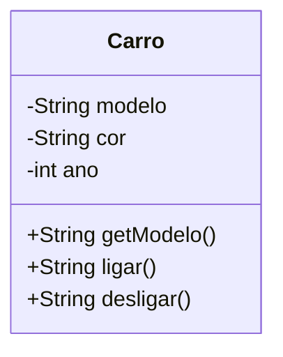
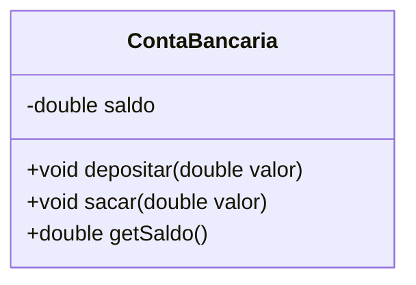
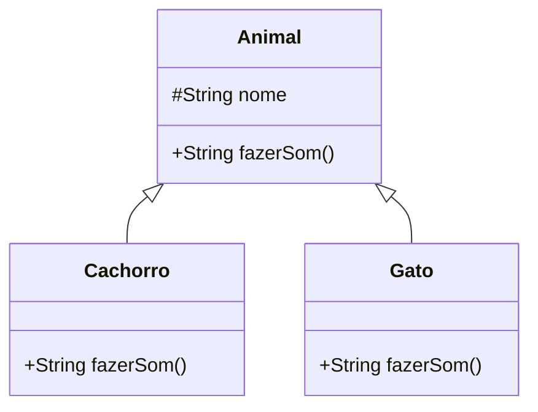
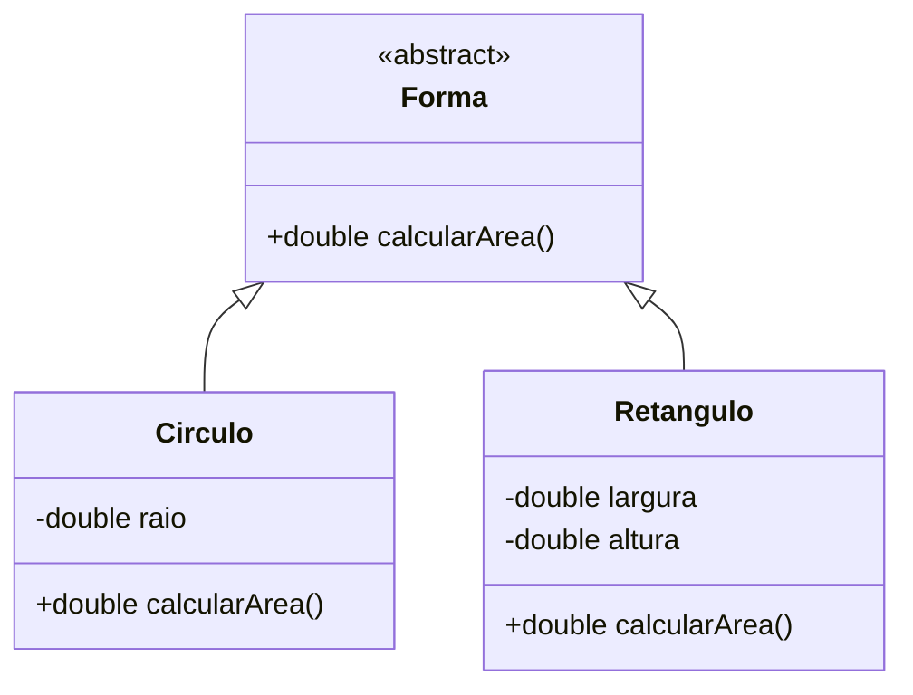
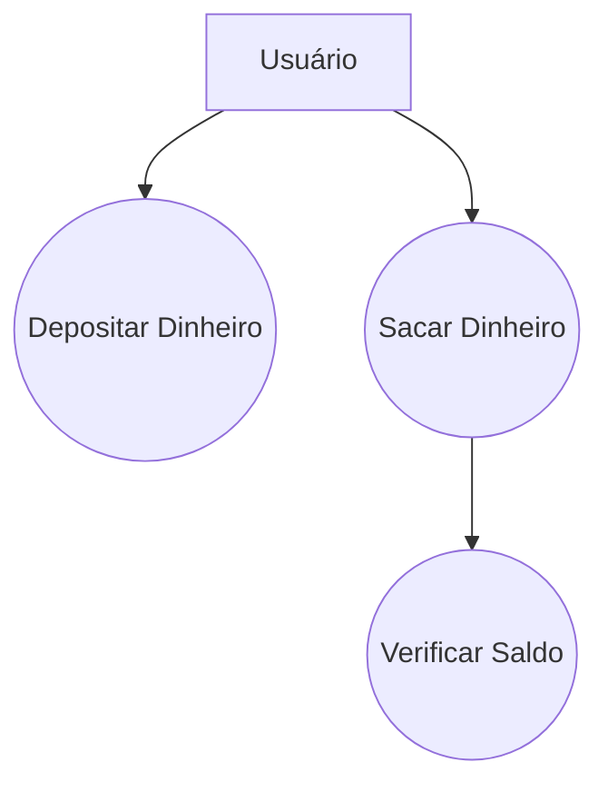

Com base no material fornecido, realizei uma revisão completa e reescrevi o guia didático, aplicando as melhores práticas de engenharia de software, separação de responsabilidades e adicionando seções essenciais sobre testes e execução em ambientes de desenvolvimento modernos.

-----

## **Guia Didático Aprimorado: Orientação a Objetos em Java**

### **1. Revisão dos Conceitos Fundamentais**

A Orientação a Objetos (OO) organiza o software em torno de **objetos**, que encapsulam **dados (atributos)** e **comportamentos (métodos)**.

  * **Classe**: Molde para criar objetos.
  * **Objeto**: Instância de uma classe.
  * **Encapsulamento**: Oculta os detalhes internos de um objeto, controlando o acesso aos seus dados através de métodos públicos (`getters`/`setters`).
  * **Herança**: Permite que uma classe (filha) herde atributos e métodos de outra (pai), promovendo o reuso de código (`extends`).
  * **Polimorfismo**: Capacidade de um objeto ser referenciado de múltiplas formas, geralmente permitindo que métodos com a mesma assinatura tenham comportamentos diferentes em subclasses (`@Override`).
  * **Abstração**: Foca nos aspectos essenciais, escondendo complexidade. Implementada via **classes abstratas** e **interfaces**.

### **2. Estrutura e Configuração do Projeto**

Uma estrutura de pacotes bem definida é fundamental para a manutenibilidade. A abordagem "sem ferramentas de build" é útil para aprendizado, mas projetos reais utilizam **Maven** ou **Gradle**. Demonstraremos a estrutura com Maven, que é o padrão da indústria.

#### **Estrutura de Pastas (Padrão Maven)**

```
estudo-oo-java/
├── pom.xml                 # Arquivo de configuração do Maven
└── src/
    ├── main/
    │   └── java/
    │       └── br/
    │           └── com/
    │               └── oo/ # Pacote raiz da aplicação
    └── test/
        └── java/
            └── br/
                └── com/
                    └── oo/ # Pacote raiz dos testes
```

**Comando para criar um projeto Maven via terminal:**

```bash
mvn archetype:generate -DgroupId=br.com.oo -DartifactId=estudo-oo-java -DarchetypeArtifactId=maven-archetype-quickstart -DinteractiveMode=false
```

-----

### **3. Pilares da OO com Código Revisado**

As implementações foram refatoradas para seguir o **Princípio da Responsabilidade Única (SRP)**. As classes de domínio (ex: `Carro`, `ContaBancaria`) não devem ser responsáveis por imprimir no console. Elas devem retornar dados, e a classe que as utiliza (a "camada de apresentação", como a `Main`) decide como exibi-los.

#### **3.1. Classes e Objetos**

  * **Motivação da Melhoria**: O método `ligar()` foi alterado para retornar uma `String` em vez de imprimir diretamente. Isso desacopla a lógica de negócio da apresentação, tornando a classe `Carro` mais reutilizável e testável.

**Estrutura de Arquivos:**

```
src/main/java/br/com/oo/basico/
├── Carro.java
└── Main.java
```

**`Carro.java` (Revisado)**

```java
package br.com.oo.basico;

public class Carro {
    private String modelo;
    private String cor;
    private int ano;

    public Carro(String modelo, String cor, int ano) {
        this.modelo = modelo;
        this.cor = cor;
        this.ano = ano;
    }

    public String getModelo() {
        return modelo;
    }

    public String ligar() {
        return "O carro " + this.modelo + " (" + this.ano + ") está ligado.";
    }

    public String desligar() {
        return "O carro " + this.modelo + " está desligado.";
    }
}
```

**`Main.java`**

```java
package br.com.oo.basico;

public class Main {
    public static void main(String[] args) {
        Carro meuCarro = new Carro("Fusca", "azul", 1975);

        System.out.println("Modelo: " + meuCarro.getModelo());
        System.out.println(meuCarro.ligar());
        System.out.println(meuCarro.desligar());
    }
}
```

**Diagrama de Classe:**



#### **3.2. Encapsulamento e Tratamento de Exceções**

  * **Motivação da Melhoria**: Lançar exceções (`IllegalArgumentException`) é a prática correta para lidar com estados inválidos (ex: sacar um valor negativo). Isso é mais robusto do que imprimir mensagens de erro, pois força o código cliente a tratar a falha explicitamente (com `try-catch`).

**Estrutura de Arquivos:**

```
src/main/java/br/com/oo/encapsulamento/
├── ContaBancaria.java
└── Main.java
```

**`ContaBancaria.java` (Revisado)**

```java
package br.com.oo.encapsulamento;

public class ContaBancaria {
    private double saldo;

    public ContaBancaria(double saldoInicial) {
        if (saldoInicial < 0) {
            throw new IllegalArgumentException("Saldo inicial não pode ser negativo.");
        }
        this.saldo = saldoInicial;
    }

    public void depositar(double valor) {
        if (valor <= 0) {
            throw new IllegalArgumentException("O valor do depósito deve ser positivo.");
        }
        this.saldo += valor;
    }

    public void sacar(double valor) {
        if (valor <= 0) {
            throw new IllegalArgumentException("O valor do saque deve ser positivo.");
        }
        if (valor > this.saldo) {
            throw new IllegalStateException("Saldo insuficiente para o saque.");
        }
        this.saldo -= valor;
    }

    public double getSaldo() {
        return this.saldo;
    }
}
```

**`Main.java`**

```java
package br.com.oo.encapsulamento;

public class Main {
    public static void main(String[] args) {
        ContaBancaria minhaConta = new ContaBancaria(1000.0);
        System.out.println("Saldo inicial: R$" + minhaConta.getSaldo());

        try {
            minhaConta.depositar(500.0);
            System.out.println("Depósito de R$500.00 realizado. Novo saldo: R$" + minhaConta.getSaldo());

            minhaConta.sacar(300.0);
            System.out.println("Saque de R$300.00 realizado. Novo saldo: R$" + minhaConta.getSaldo());

            minhaConta.sacar(1500.0); // Isso vai lançar uma exceção

        } catch (IllegalArgumentException | IllegalStateException e) {
            System.err.println("Erro na operação: " + e.getMessage());
        }

        System.out.println("Saldo final: R$" + minhaConta.getSaldo());
    }
}
```

**Diagrama de Classe:**



#### **3.3. Herança e Polimorfismo**

  * **Motivação da Melhoria**: Assim como antes, os métodos `fazerSom()` e `voar()` devem retornar o resultado, não imprimi-lo. Isso permite que a lógica seja testada e reutilizada em diferentes contextos (ex: em uma API web, em vez de um console).

**Estrutura de Arquivos (Herança):**

```
src/main/java/br/com/oo/heranca/
├── Animal.java
├── Cachorro.java
├── Gato.java
└── Main.java
```

**`Animal.java` (Superclasse)**

```java
package br.com.oo.heranca;

public class Animal {
    protected String nome;

    public Animal(String nome) {
        this.nome = nome;
    }

    public String fazerSom() {
        return "O animal faz um som genérico.";
    }
}
```

**`Cachorro.java` (Subclasse)**

```java
package br.com.oo.heranca;

public class Cachorro extends Animal {
    public Cachorro(String nome) {
        super(nome); // Chama o construtor de Animal
    }

    @Override
    public String fazerSom() {
        return this.nome + " faz: Au Au!";
    }
}
```

**`Main.java` (Demonstrando Polimorfismo)**

```java
package br.com.oo.heranca;

public class Main {
    // Este método demonstra o polimorfismo: ele aceita qualquer objeto 'Animal'.
    public static void emitirSom(Animal animal) {
        System.out.println(animal.fazerSom());
    }

    public static void main(String[] args) {
        Animal cachorro = new Cachorro("Rex");
        Animal gato = new Gato("Mimi"); // Supondo que a classe Gato exista

        emitirSom(cachorro); // Saída: Rex faz: Au Au!
        emitirSom(gato);     // Saída: Mimi faz: Miau!
    }
}
```

**Diagrama de Classe:**



#### **3.4. Abstração (Classes Abstratas e Interfaces)**

  * **Motivação**: O exemplo original com a classe abstrata `Forma` já é muito bom e segue boas práticas, pois o método `calcularArea()` retorna um valor. Nenhuma alteração de código é necessária, apenas a garantia da estrutura correta.

**Estrutura de Arquivos:**

```
src/main/java/br/com/oo/abstracao/
├── Forma.java
├── Circulo.java
├── Retangulo.java
└── Main.java
```

**`Forma.java` (Classe Abstrata)**

```java
package br.com.oo.abstracao;

// Não pode ser instanciada diretamente. Define um contrato.
public abstract class Forma {
    // Método abstrato: subclasses SÃO OBRIGADAS a implementar.
    public abstract double calcularArea();
}
```

**`Circulo.java` (Implementação Concreta)**

```java
package br.com.oo.abstracao;

public class Circulo extends Forma {
    private final double raio;

    public Circulo(double raio) {
        this.raio = raio;
    }

    @Override
    public double calcularArea() {
        return Math.PI * this.raio * this.raio;
    }
}
```

**Diagrama de Classe:**



-----

### **4. Testes Unitários com JUnit 5**

Testes unitários são essenciais para garantir a qualidade e a manutenibilidade do código. Eles validam as menores partes da sua aplicação (unidades) de forma isolada.

**Etapa 1: Adicionar Dependência do JUnit (em `pom.xml`)**

```xml
<dependencies>
    <dependency>
        <groupId>org.junit.jupiter</groupId>
        <artifactId>junit-jupiter-api</artifactId>
        <version>5.10.2</version>
        <scope>test</scope>
    </dependency>
</dependencies>
```

**Etapa 2: Criar a Classe de Teste**

**Estrutura de Arquivos:**

```
src/test/java/br/com/oo/encapsulamento/
└── ContaBancariaTest.java
```

**`ContaBancariaTest.java`**

```java
package br.com.oo.encapsulamento;

import org.junit.jupiter.api.Test;
import static org.junit.jupiter.api.Assertions.*;

class ContaBancariaTest {

    @Test
    void deveDepositarCorretamente() {
        ContaBancaria conta = new ContaBancaria(100.0);
        conta.depositar(50.0);
        assertEquals(150.0, conta.getSaldo());
    }

    @Test
    void deveSacarCorretamente() {
        ContaBancaria conta = new ContaBancaria(200.0);
        conta.sacar(50.0);
        assertEquals(150.0, conta.getSaldo());
    }

    @Test
    void deveLancarExcecaoParaSaqueComValorNegativo() {
        ContaBancaria conta = new ContaBancaria(100.0);
        // Verifica se a exceção esperada é lançada pela lambda
        assertThrows(IllegalArgumentException.class, () -> {
            conta.sacar(-50.0);
        });
    }

    @Test
    void deveLancarExcecaoParaSaldoInsuficiente() {
        ContaBancaria conta = new ContaBancaria(100.0);
        assertThrows(IllegalStateException.class, () -> {
            conta.sacar(200.0);
        });
    }
}
```

-----

### **5. Executando e Depurando o Projeto**

#### **No VS Code (com Extension Pack for Java)**

1.  **Executar**: Abra qualquer arquivo `.java` com um método `main`. Acima do método, clique no botão **Run**. O output aparecerá no painel **TERMINAL**.
2.  **Depurar**:
      * Clique na margem esquerda de uma linha de código para adicionar um **breakpoint** (ponto vermelho).
      * Clique em **Debug** (ao lado de **Run**) ou pressione `F5`.
      * A execução pausará no breakpoint. Use a barra de ferramentas de depuração para controlar o fluxo:
          * **Continue (`F5`)**: Continua até o próximo breakpoint.
          * **Step Over (`F10`)**: Executa a linha atual e vai para a próxima.
          * **Step Into (`F11`)**: Entra na execução de um método.
          * **Step Out (`Shift+F11`)**: Sai do método atual.
3.  **Executar Testes**: Abra o arquivo de teste (`ContaBancariaTest.java`). Clique no ícone de "play" ao lado do nome da classe para rodar todos os testes, ou ao lado de um método para rodar um teste específico.

#### **Nas IDEs JetBrains (IntelliJ IDEA)**

1.  **Executar**:
      * Abra um arquivo com um método `main`.
      * Clique na seta verde na margem esquerda ao lado da declaração do método `main` e selecione **"Run 'Main.main()'"**.
      * Alternativamente, use o atalho `Shift + F10`.
2.  **Depurar**:
      * Clique na margem para adicionar um **breakpoint**.
      * Clique na seta verde e selecione **"Debug 'Main.main()'"** ou use o atalho `Shift + F9`.
      * Os controles de depuração (`F7`, `F8`, `F9`) são similares aos do VS Code e aparecem no painel **Debug**.
3.  **Run/Debug Configurations**: No canto superior direito, você pode criar e gerenciar configurações de execução, personalizando argumentos de VM, variáveis de ambiente e mais.
4.  **Executar Testes**: A IDE detecta automaticamente as classes de teste JUnit. Clique na seta verde ao lado do nome da classe ou do método de teste para executá-los. Os resultados aparecem em um painel dedicado.

-----

### **6. Sugestões Arquiteturais**

Os conceitos de OO são a base para padrões arquiteturais como o **MVC (Model-View-Controller)**.

  * **Model**: As classes de domínio que criamos (`Carro`, `ContaBancaria`, `Forma`). Elas contêm os dados e a lógica de negócio. Elas não sabem como serão exibidas.
  * **View**: A camada de apresentação. No nosso caso, o `System.out.println` é uma view extremamente simples. Em aplicações reais, seria uma interface gráfica (Swing, JavaFX) ou uma página web (HTML renderizado por um framework).
  * **Controller**: A classe que orquestra a interação. Nossas classes `Main` atuam como controllers: elas recebem a "requisição" (início do programa), instanciam os Models e enviam os dados para a View (console).

Adotar essa separação desde o início, mesmo em projetos pequenos, resulta em um código mais organizado, testável e fácil de manter.

**Diagrama de Caso de Uso Simples (Operação Bancária):**

