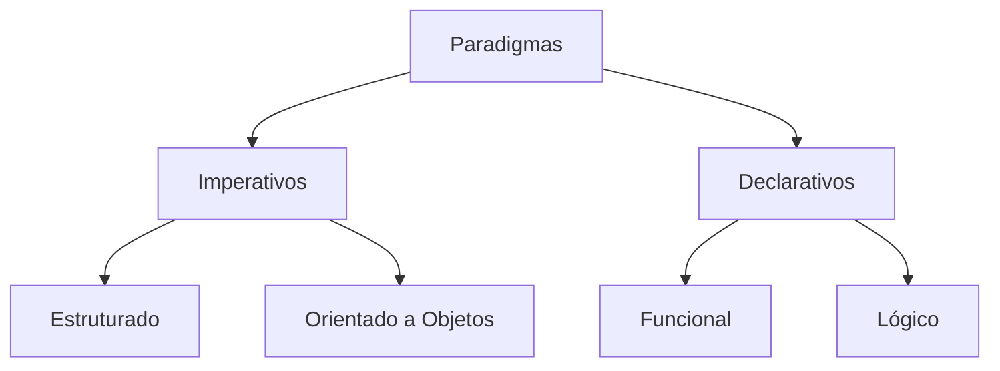

# Aula 01: Introdução aos Paradigmas de Programação 🧩

## 🎯 Objetivos da Aula
- [x] Compreender o que é um paradigma de programação.
- [x] Conhecer a evolução histórica das linguagens.
- [x] Identificar os principais problemas no desenvolvimento de software.
- [x] Ter uma visão geral dos paradigmas que serão estudados.

---

## 💡 O que é um Paradigma?

Um **paradigma de programação** é uma abordagem, um estilo ou uma forma de estruturar o pensamento para resolver problemas através do código. Não é uma linguagem em si, mas um modelo mental que define como o programador vê a execução do programa.

> "Um paradigma é uma visão de mundo, um conjunto de conceitos e práticas que definem uma disciplina científica em um determinado período."

---

## ⌛ Evolução Histórica

A programação evoluiu de instruções binárias diretas para abstrações de altíssimo nível:

1.  **Código de Máquina**: Instruções diretas ao processador.
2.  **Assembly**: Mnemônicos para facilitar a leitura.
3.  **Linguagens de Alto Nível (Fortran, C)**: Foco em procedimentos e lógica imperativa.
4.  **Orientação a Objetos (Simula, Smalltalk, Java)**: Foco em modelar o mundo real.
5.  **Declarativo/Funcional (Lisp, Haskell)**: Foco no "o que" fazer, não no "como".

---

## 📊 Panorama dos Paradigmas



---

## ⚠️ Problemas Comuns no Desenvolvimento
- **Complexidade**: Sistemas grandes tornam-se difíceis de entender.
- **Rigidez**: Dificuldade em alterar o código sem quebrar outras partes.
- **Fragilidade**: Pequenas mudanças causam erros inesperados.
- **Repetição**: Código duplicado que dificulta a manutenção.

---

## 💻 Exemplo Comparativo (Soma de Lista)

### Estilo Imperativo (Como fazer)
```python
numeros = [1, 2, 3, 4, 5]
soma = 0
for n in numeros:
    soma += n
print(soma)
```

### Estilo Funcional (O que fazer)
```python
numeros = [1, 2, 3, 4, 5]
soma = sum(numeros)
print(soma)
```

---

## 🚀 Mini-projeto: Analisador de Estilo
Nesta primeira aula, vamos apenas observar diferentes formas de resolver o mesmo problema e começar a treinar nosso "olhar arquitetural".

---

## 🎯 Próximos Passos

<div class="grid cards" markdown>

-   :material-presentation: **Slides**
    -   [Ver Slides da Aula](../slides/slide-01.md)

-   :material-school: **Quiz**
    -   [Responder Quiz](../quizzes/quiz-01.md)

-   :material-dumbbell: **Exercícios**
    -   [Lista de Exercícios](../exercicios/exercicio-01.md)

-   :material-rocket: **Projeto**
    -   [Detalhamento do Projeto](../projetos/projeto-01.md)

</div>
