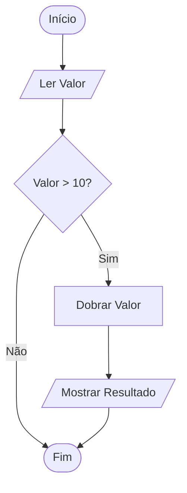

# Aula 02: Paradigma Imperativo e Estruturado 🏗️

## 🎯 Objetivos da Aula
- [x] Compreender os fundamentos do paradigma imperativo.
- [x] Aprender sobre o teorema da programação estruturada.
- [x] Explorar variáveis, controle de fluxo e modularização.
- [x] Identificar vantagens e limitações desta abordagem.

---

## 💡 O Paradigma Imperativo

O paradigma imperativo é baseado na ideia de **ordens (comandos)** que alteram o **estado** do programa. Imagine uma receita de bolo: "pegue os ovos", "misture a farinha", "asse por 40 minutos".

### Conceitos Chave:
- **Estado**: Os valores atuais das variáveis em um determinado momento.
- **Comandos**: Instruções que alteram o estado (atribuições, I/O).

---

## 🧱 Teorema da Programação Estruturada

Todo programa computável pode ser implementado usando apenas três estruturas básicas:

1.  **Sequência**: Instruções executadas uma após a outra.
2.  **Seleção (Decisão)**: `if-else`, `switch`.
3.  **Repetição (Iteração)**: `while`, `for`.

---

## 📊 Fluxograma de Controle



---

## 💻 Exemplo em Python (Imperativo)

```python
# Estado inicial
contador = 1
total = 0

# Estrutura de repetição (Iteração)
while contador <= 5:
    # Atribuição e alteração de estado
    total += contador
    contador += 1

print(f"Total acumulado: {total}")
```

```termynal-exec
python aula-02.py
Total acumulado: 15
```

---

## 🧠 Blocos de Destaque

!!! concept "Conceito: Efeito Colateral"
    No paradigma imperativo, funções costumam ter efeitos colaterais, ou seja, elas alteram variáveis fora de seu escopo local.

!!! warning "Atenção: Espaguete"
    O uso excessivo de comandos de salto (`goto`) ou lógica desestruturada pode levar ao famoso "código espaguete", difícil de manter.

---

## 🚀 Mini-projeto: Calculadora de Gastos
Vamos estruturar um pequeno script que lê gastos diários, calcula a média e aplica descontos usando apenas estruturas estruturadas.

---

## 🎯 Próximos Passos

<div class="grid cards" markdown>

-   :material-presentation: **Slides**
    -   [Ver Slides da Aula](../slides/slide-02.md)

-   :material-school: **Quiz**
    -   [Responder Quiz](../quizzes/quiz-02.md)

-   :material-dumbbell: **Exercícios**
    -   [Lista de Exercícios](../exercicios/exercicio-02.md)

-   :material-rocket: **Projeto**
    -   [Detalhamento do Projeto](../projetos/projeto-02.md)

</div>
