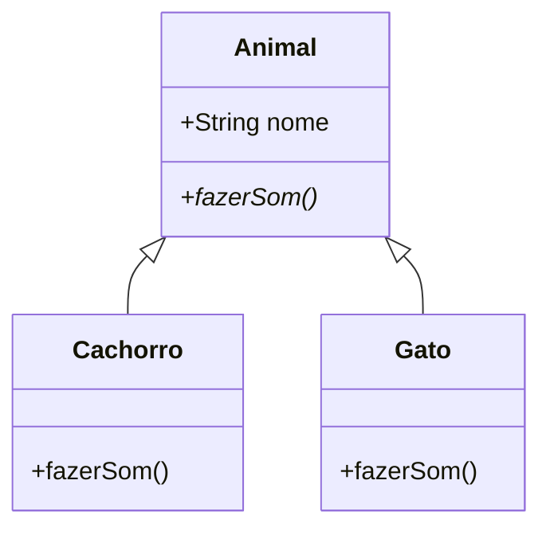

# Aula 03: Paradigma Orientado a Objetos (POO) 📦

## 🎯 Objetivos da Aula
- [x] Compreender os pilares da POO: Classe e Objeto.
- [x] Aprender sobre Encapsulamento, Herança e Polimorfismo.
- [x] Modelar sistemas simples usando objetos.
- [x] Comparar a abordagem OO com a estruturada.

---

## 💡 O que é POO?

A Orientação a Objetos é um paradigma que organiza o código em torno de **dados (objetos)** em vez de funções/lógica. Um objeto é uma "entidade" que possui **características (atributos)** e **comportamentos (métodos)**.

---

## 🧱 Os 4 Pilares da POO

1.  **Abstração**: Focar apenas no que é essencial para o sistema.
2.  **Encapsulamento**: Esconder os detalhes internos e proteger os dados.
3.  **Herança**: Reutilizar comportamentos e atributos de classes pai.
4.  **Polimorfismo**: Capacidade de um objeto ser tratado de múltiplas formas.

---

## 📊 Diagrama de Classes (Herança)



---

## 💻 Exemplo Prático (Python)

```python
class Veiculo:
    def __init__(self, marca):
        self._marca = marca # Encapsulamento (protegido)

    def mover(self):
        print(f"O {self._marca} está se movendo.")

class Carro(Veiculo): # Herança
    def mover(self): # Polimorfismo
        print(f"O carro {self._marca} está acelerando na estrada.")

meu_carro = Carro("Toyota")
meu_carro.mover()
```

```termynal-exec
python aula-03.py
O carro Toyota está acelerando na estrada.
```

---

## 🧠 Destaques

!!! tip "Dica de Modelagem"
    Sempre pergunte: "Isso É UM..." (para Herança) ou "Isso TEM UM..." (para Composição).

!!! note "Vantagem principal"
    A POO brilha em sistemas grandes onde a reutilização de código e a organização modular são críticas para o sucesso.

---

## 🚀 Mini-projeto: Sistema de Biblioteca
Vamos modelar uma pequena biblioteca onde Livros e Usuários interagem através de objetos e métodos específicos.

---

## 🎯 Próximos Passos

<div class="grid cards" markdown>

-   :material-presentation: **Slides**
    -   [Ver Slides da Aula](../slides/slide-03.md)

-   :material-school: **Quiz**
    -   [Responder Quiz](../quizzes/quiz-03.md)

-   :material-dumbbell: **Exercícios**
    -   [Lista de Exercícios](../exercicios/exercicio-03.md)

-   :material-rocket: **Projeto**
    -   [Detalhamento do Projeto](../projetos/projeto-03.md)

</div>
