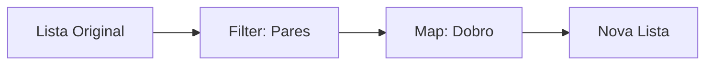

# Aula 04: Paradigma Funcional ⚡

## 🎯 Objetivos da Aula
- [x] Compreender o conceito de Programação Declarativa.
- [x] Aprender sobre Funções Puras e Efeitos Colaterais.
- [x] Entender a importância da Imutabilidade.
- [x] Manipular listas com funções de alta ordem (Map, Filter, Reduce).

---

## 💡 O Paradigma Funcional

Diferente do imperativo, o paradigma funcional trata a computação como a avaliação de **funções matemáticas** e evita mudar estados ou dados mutáveis.

### Conceitos Fundamentais:
- **Funções Puras**: Dada a mesma entrada, sempre retornam a mesma saída e não causam efeitos colaterais.
- **Imutabilidade**: Uma vez criado, um dado não pode ser alterado. Cria-se um novo dado a partir do antigo.

---

## 📊 Fluxo Funcional (Map, Filter)



---

## 💻 Exemplo Prático (Python)

```python
numeros = [1, 2, 3, 4, 5, 6]

# Programação Declarativa / Funcional
pares = filter(lambda x: x % 2 == 0, numeros)
dobrados = map(lambda x: x * 2, pares)

print(list(dobrados)) # Output: [4, 8, 12]
```

```termynal-exec
python aula-04.py
[4, 8, 12]
```

---

## 🧠 Blocos de Destaque

!!! concept "Alta Ordem (Higher-Order)"
    Funções que recebem outras funções como argumento ou retornam funções. É a base da flexibilidade funcional.

!!! info "Por que usar?"
    O código funcional tende a ser mais conciso, previsível e fácil de testar, além de ser excelente para processamento paralelo.

---

## 🚀 Mini-projeto: Analisador de Texto
Vamos criar um processador de texto que conta palavras, remove stop words e gera estatísticas usando apenas transformações de dados (sem loops `for` manuais).

---

## 🎯 Próximos Passos

<div class="grid cards" markdown>

-   :material-presentation: **Slides**
    -   [Ver Slides da Aula](../slides/slide-04.md)

-   :material-school: **Quiz**
    -   [Responder Quiz](../quizzes/quiz-04.md)

-   :material-dumbbell: **Exercícios**
    -   [Lista de Exercícios](../exercicios/exercicio-04.md)

-   :material-rocket: **Projeto**
    -   [Detalhamento do Projeto](../projetos/projeto-04.md)

</div>
