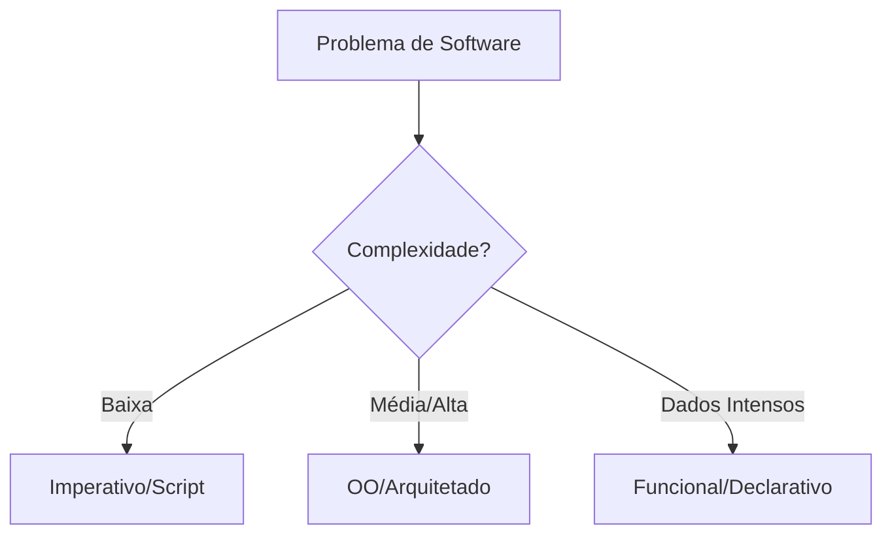

# Aula 05: Comparando Paradigmas na Prática ⚖️

## 🎯 Objetivos da Aula
- [x] Comparar a resolução do mesmo problema em diferentes paradigmas.
- [x] Identificar vantagens e desvantagens de cada abordagem.
- [x] Entender quando escolher um paradigma sobre outro.

---

## 💡 O Desafio: Filtro e Soma
Vamos resolver o seguinte problema: "Dada uma lista de produtos, filtre os que custam mais de R$ 50,00 e calcule o valor total com um imposto de 10%."

---

## 📊 Tabela de Comparação

| Critério | Imperativo | Orientado a Objetos | Funcional |
| :--- | :--- | :--- | :--- |
| **Foco** | Sequência de passos | Entidades e Dados | Transformação de Dados |
| **Legibilidade** | Média (muitos loops) | Alta (abstração) | Altíssima (concição) |
| **Manutenibilidade** | Difícil em larga escala | Excelente (modular) | Ótima (previsível) |

---

## 💻 Resoluções em Python

### 1. Abordagem Imperativa
```python
produtos = [10, 60, 20, 80, 50]
total = 0
for p in produtos:
    if p > 50:
        total += p * 1.1
print(f"Total Imperativo: {total}")
```

### 2. Abordagem Funcional
```python
produtos = [10, 60, 20, 80, 50]
total = sum(map(lambda p: p * 1.1, filter(lambda p: p > 50, produtos)))
print(f"Total Funcional: {total}")
```

---

## 📊 Fluxo de Decisão



---

## 🧠 Blocos de Destaque

!!! quote "Trade-offs"
    Não existe "bala de prata". O estilo funcional é ótimo para processamento, mas a POO é imbatível para modelagem de domínios complexos.

!!! warning "Atenção"
    Misturar paradigmas sem critério pode tornar o código confuso. O segredo é a consistência.

---

## 🚀 Mini-projeto: Refatorador de Paradigmas
Vamos pegar um código totalmente imperativo e refatorá-lo para um estilo Híbrido (OO + Funcional), aproveitando o melhor de cada mundo.

---

## 🎯 Próximos Passos

<div class="grid cards" markdown>

-   :material-presentation: **Slides**
    -   [Ver Slides da Aula](../slides/slide-05.md)

-   :material-school: **Quiz**
    -   [Responder Quiz](../quizzes/quiz-05.md)

-   :material-dumbbell: **Exercícios**
    -   [Lista de Exercícios](../exercicios/exercicio-05.md)

-   :material-rocket: **Projeto**
    -   [Detalhamento do Projeto](../projetos/projeto-05.md)

</div>
