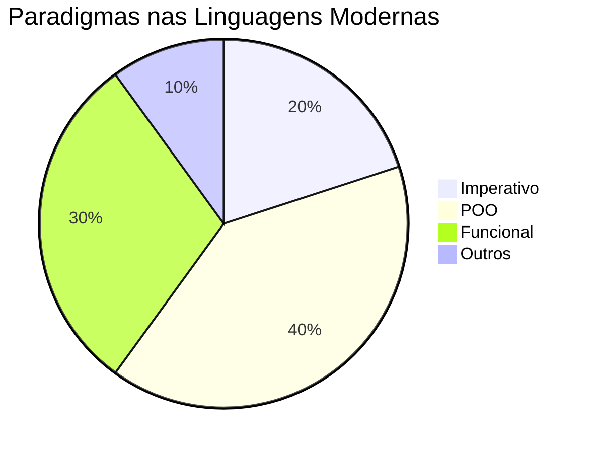

# Aula 06: Paradigmas Modernos e Multi-Paradigma 🌐

## 🎯 Objetivos da Aula
- [x] Conhecer o conceito de linguagens multi-paradigma.
- [x] Explorar como linguagens modernas integram diferentes estilos.
- [x] Identificar as tendências atuais no desenvolvimento de software.

---

## 💡 O que é Multi-Paradigma?

A maioria das linguagens de destaque hoje (Python, JavaScript, Java, C#, Swift, Rust) não se limita a um único paradigma. Elas permitem que o desenvolvedor utilize POO para estrutura e Funcional para manipulação de dados, por exemplo.

---

## 🧱 Exemplo: O Ecossistema JavaScript

O JavaScript é o rei do multi-paradigma:
- **Imperativo**: Manipulação direta do DOM.
- **Funcional**: `map`, `filter`, `reduce` em arrays.
- **Orientado a Objetos**: Classes (ES6+) e protótipos.

---

## 📊 Linguagens e seus Paradigmas



---

## 💻 Exemplo Prático (List Comprehensions em Python)

Python usa técnicas funcionais dentro de um ambiente OO/Imperativo:

```python
# Híbrido: List Comprehension (Funcional) + Objeto (OO)
class Aluno:
    def __init__(self, nome, nota):
        self.nome = nome
        self.nota = nota

alunos = [Aluno("Ana", 8), Aluno("Beto", 4), Aluno("Caio", 9)]

# Estilo funcional em uma linha
aprovados = [a.nome for a in alunos if a.nota >= 6]

print(f"Aprovados: {aprovados}")
```

```termynal-exec
python aula-06.py
Aprovados: ['Ana', 'Caio']
```

---

## 🧠 Destaques

!!! tip "Dica de Carreira"
    Saber transitar entre paradigmas é um dos diferenciais que separa um programador júnior de um sênior.

!!! info "Tendência: Rust"
    A linguagem Rust está ganhando popularidade por combinar alto desempenho (imperativo) com segurança de memória rigorosa e conceitos funcionais avançados.

---

## 🚀 Mini-projeto: Conversor Híbrido
Desenvolva um pequeno sistema que utiliza classes para representar entidades e funções de alta ordem para processar coleções dessas entidades.

---

## 🎯 Próximos Passos

<div class="grid cards" markdown>

-   :material-presentation: **Slides**
    -   [Ver Slides da Aula](../slides/slide-06.md)

-   :material-school: **Quiz**
    -   [Responder Quiz](../quizzes/quiz-06.md)

-   :material-dumbbell: **Exercícios**
    -   [Lista de Exercícios](../exercicios/exercicio-06.md)

-   :material-rocket: **Projeto**
    -   [Detalhamento do Projeto](../projetos/projeto-06.md)

</div>
