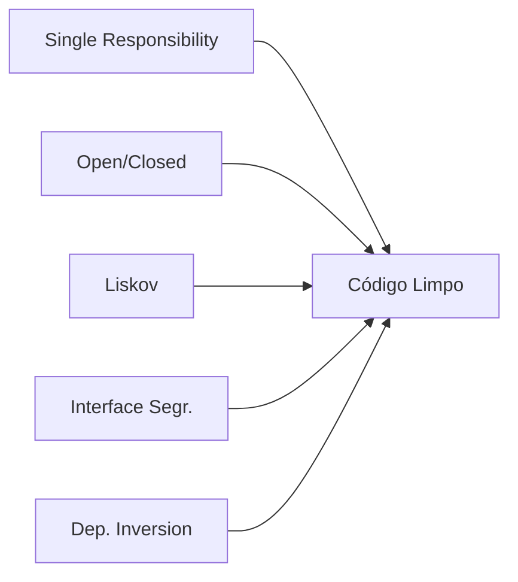

# Aula 07: Princípios de Projeto de Software (SOLID) 📐

## 🎯 Objetivos da Aula
- [x] Compreender os conceitos de Acoplamento e Coesão.
- [x] Aprender o significado das 5 letras do acrônimo SOLID.
- [x] Aplicar boas práticas de organização de código.

---

## 💡 Acoplamento vs Coesão

- **Coesão**: O quanto uma classe faz apenas o que ela se propõe a fazer. (*Alta coesão é boa!*)
- **Acoplamento**: O quanto uma classe depende de outra para funcionar. (*Baixo acoplamento é bom!*)

---

## 🧱 O que é SOLID?

Apresentado por Robert C. Martin (Uncle Bob), são 5 princípios para tornar o software mais compreensível e flexível:

1.  **S (SRP)**: Responsabilidade Única.
2.  **O (OCP)**: Aberto/Fechado (Aberto para extensão, fechado para modificação).
3.  **L (LSP)**: Substituição de Liskov.
4.  **I (ISP)**: Segregação de Interfaces.
5.  **D (DIP)**: Inversão de Dependência.

---

## 📊 Visualização SOLID



---

## 💻 Exemplo: SRP (Violando vs Seguindo)

### Violando (Uma classe faz tudo)
```python
class Usuario:
    def salvar_no_banco(self):
        pass
    def enviar_email(self):
        pass
```

### Seguindo (Responsabilidades divididas)
```python
class UsuarioRepositorio:
    def salvar(self, usuario):
        pass

class EmailService:
    def enviar(self, usuario):
        pass
```

---

## 🧠 Blocos de Destaque

!!! warning "Atenção"
    Não tente aplicar todos os princípios SOLID de uma vez em sistemas minúsculos. O excesso de abstração pode gerar complexidade desnecessária (*Overengineering*).

!!! info "Dica"
    O princípio **D (Inversão de Dependência)** é a base para quase todos os Padrões de Projeto que veremos em seguida.

---

## 🚀 Mini-projeto: Refatoração SOLID
Pegue uma classe "Deus" (que faz tudo) e divida suas responsabilidades em classes menores e coesas.

---

## 🎯 Próximos Passos

<div class="grid cards" markdown>

-   :material-presentation: **Slides**
    -   [Ver Slides da Aula](../slides/slide-07.md)

-   :material-school: **Quiz**
    -   [Responder Quiz](../quizzes/quiz-07.md)

-   :material-dumbbell: **Exercícios**
    -   [Lista de Exercícios](../exercicios/exercicio-07.md)

-   :material-rocket: **Projeto**
    -   [Detalhamento do Projeto](../projetos/projeto-07.md)

</div>
