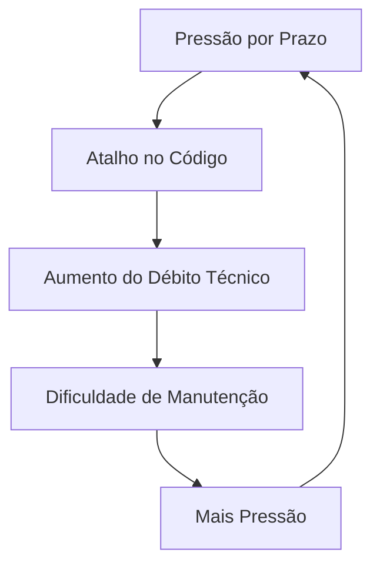

# Aula 08: Problemas Comuns de Design ⚠️

## 🎯 Objetivos da Aula
- [x] Identificar os principais "sintomas" de um código ruim.
- [x] Entender o conceito de "Code Smells" (Mau Cheiro no Código).
- [x] Compreender por que o software se torna rígido e frágil.
- [x] Introduzir a necessidade dos Padrões de Projeto.

---

## 💡 O software apodrece?

Sim, se não for bem cuidado. Esse processo é chamado de **Erosão Arquitetural**. Os principais sintomas são:

1.  **Rigidez**: Difícil de mudar.
2.  **Fragilidade**: Muda aqui, quebra lá.
3.  **Imobilidade**: Não dá para reaproveitar partes do código.
4.  **Viscosidade**: Fazer o certo é mais difícil do que fazer o "atalho".

---

## 🧱 Exemplos de Code Smells

- **Código Duplicado**: A mesma lógica em vários lugares.
- **Método Longo**: Funções com centenas de linhas.
- **Classe Grande**: Classes que tentam ser o sistema inteiro.
- **Inveja de Escopo**: Uma classe que se interessa mais pelos dados de outra do que pelos seus.

---

## 📊 Ciclo de Vida do Débito Técnico



---

## 💻 Exemplo: Código Rígido (If/Else Infinitos)

```python
def calcular_desconto(tipo_cliente, valor):
    if tipo_cliente == "GOLD":
        return valor * 0.9
    elif tipo_cliente == "SILVER":
        return valor * 0.95
    # Se surgir um novo tipo, temos que ALTERAR esta função (Violando OCP)
    return valor
```

```termynal-exec
# Como resolveríamos isso com padrões? Veremos em breve!
```

---

## 🧠 Destaques

!!! note "Conceito: Débito Técnico"
    É como um empréstimo: você ganha velocidade agora, mas terá que pagar com juros (tempo de manutenção) depois.

!!! tip "Dica"
    Sempre deixe o código um pouco mais limpo do que você o encontrou (*Regra do Escoteiro*).

---

## 🚀 Mini-projeto: Auditoria de Código
Analise um código fornecido e liste pelo menos 5 "code smells", sugerindo como poderiam ser evitados com os princípios aprendidos na aula anterior.

---

## 🎯 Próximos Passos

<div class="grid cards" markdown>

-   :material-presentation: **Slides**
    -   [Ver Slides da Aula](../slides/slide-08.md)

-   :material-school: **Quiz**
    -   [Responder Quiz](../quizzes/quiz-08.md)

-   :material-dumbbell: **Exercícios**
    -   [Lista de Exercícios](../exercicios/exercicio-08.md)

-   :material-rocket: **Projeto**
    -   [Detalhamento do Projeto](../projetos/projeto-08.md)

</div>
