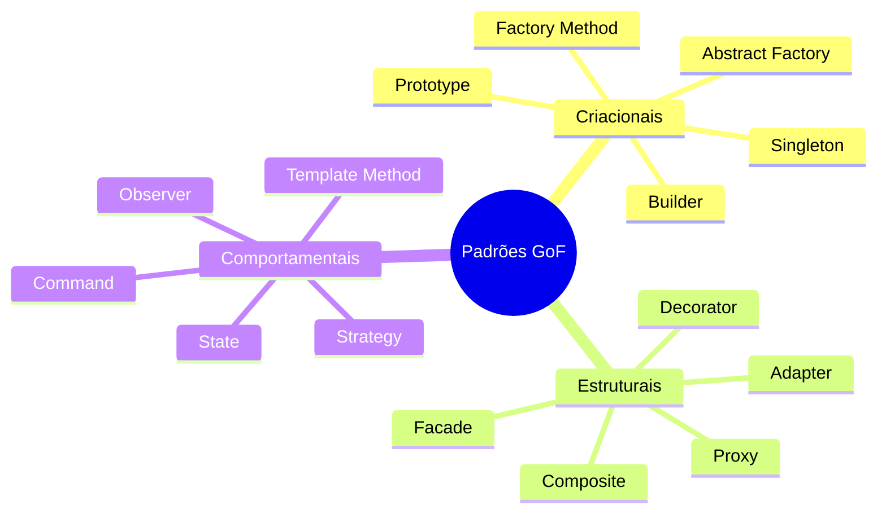

# Aula 09: Introdução aos Padrões de Projeto 📖

## 🎯 Objetivos da Aula
- [x] Compreender o que são Design Patterns (Padrões de Projeto).
- [x] Conhecer a origem dos padrões no livro "Gang of Four" (GoF).
- [x] Identificar as três grandes categorias: Criacionais, Estruturais e Comportamentais.
- [x] Entender os benefícios (e riscos) de usar padrões.

---

## 💡 O que são Padrões de Projeto?

Padrões de Projeto são soluções reutilizáveis para problemas comuns que ocorrem durante o design de software. Eles não são bibliotecas ou frameworks, mas sim **estratégias e modelos de organização** de classes e objetos.

> "Não reinvente a roda. Use uma roda que já foi testada e aprovada."

---

## 📚 A Origem: Gang of Four

Em 1994, Erich Gamma, Richard Helm, Ralph Johnson e John Vlissides publicaram o livro **"Design Patterns: Elements of Reusable Object-Oriented Software"**. Eles catalogaram 23 padrões fundamentais divididos em:

1.  **Criacionais**: Como os objetos são criados.
2.  **Estruturais**: Como classes e objetos são compostos.
3.  **Comportamentais**: Como os objetos interagem e distribuem responsabilidades.

---

## 📊 Categorias de Padrões

---

## 💻 Por que usar? (Vantagens)

- **Linguagem Comum**: "Use um Singleton aqui" é mais rápido do que explicar toda a lógica.
- **Robustez**: Soluções testadas por milhares de desenvolvedores.
- **Flexibilidade**: Facilita a manutenção e evolução do sistema.

---

## 🧠 Blocos de Destaque

!!! warning "O Perigo: Overengineering"
    Usar padrões onde não são necessários torna o código complexo sem benefício. Padrões devem ser aplicados para resolver problemas, não para "parecer inteligente".

!!! tip "Dica de Estudo"
    Foque em entender o **problema** que o padrão resolve antes de decorar a **solução**.

---

## 🚀 Mini-projeto: Catálogo de Problemas
Identifique 3 problemas comuns que você já enfrentou codificando e tente adivinhar (ou pesquisar) qual categoria de padrão poderia resolvê-los.

---

## 🎯 Próximos Passos

-   :material-presentation: **Slides**
    -   [Ver Slides da Aula](../slides/slide-09.md)

-   :material-school: **Quiz**
    -   [Responder Quiz](../quizzes/quiz-09.md)

-   :material-dumbbell: **Exercícios**
    -   [Lista de Exercícios](../exercicios/exercicio-09.md)

-   :material-rocket: **Projeto**
    -   [Detalhamento do Projeto](../projetos/projeto-09.md)

