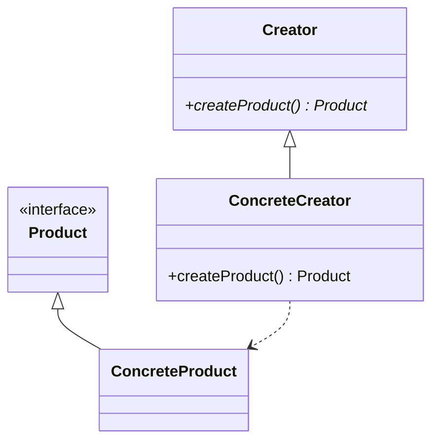

# Aula 10: Padrões Criacionais 🏭

## 🎯 Objetivos da Aula
- [x] Aprender os padrões Singleton, Factory Method e Builder.
- [x] Compreender quando impedir a criação de múltiplas instâncias.
- [x] Desacoplar a lógica de criação da lógica de negócio.
- [x] Construir objetos complexos passo a passo.

---

## 💡 O que são Padrões Criacionais?

Eles abstraem o processo de instanciação. Eles ajudam a tornar um sistema independente de como seus objetos são criados, compostos e representados.

---

## 🧱 Os Grandes Destaques

### 1. Singleton 👤
Garante que uma classe tenha apenas uma instância e fornece um ponto global de acesso a ela.
*Exemplo: Conexão com Banco de Dados, Log.*

### 2. Factory Method 🏗️
Define uma interface para criar um objeto, mas deixa as subclasses decidirem qual classe instanciar.

### 3. Builder 👷
Separa a construção de um objeto complexo da sua representação, permitindo que o mesmo processo de construção crie diferentes representações.

---

## 📊 Diagrama: Factory Method



---

## 💻 Exemplo: Singleton em Python

```python
class DatabaseConnection:
    _instance = None

    def __new__(cls):
        if cls._instance is None:
            cls._instance = super(DatabaseConnection, cls).__new__(cls)
            print("Conectando ao banco...")
        return cls._instance

db1 = DatabaseConnection()
db2 = DatabaseConnection()

print(f"São a mesma instância? {db1 is db2}")
```

```termynal-exec
python aula-10-singleton.py
Conectando ao banco...
São a mesma instância? True
```

---

## 🧠 Blocos de Destaque

!!! danger "Cuidado com o Singleton"
    O Singleton pode ser considerado um "anti-padrão" se usado em excesso, pois cria um estado global oculto que dificulta os testes unitários.

!!! info "Builder vs Factory"
    Use **Factory** quando a criação é simples (uma linha). Use **Builder** quando o objeto tem muitos parâmetros opcionais ou passos de construção.

---

## 🚀 Mini-projeto: Gerador de Documentos
Crie um sistema que utiliza o padrão **Factory** para gerar diferentes tipos de documentos (PDF, JSON, HTML) sem que o cliente saiba qual classe específica está sendo instanciada.

---

## 🎯 Próximos Passos

<div class="grid cards" markdown>

-   :material-presentation: **Slides**
    -   [Ver Slides da Aula](../slides/slide-10.md)

-   :material-school: **Quiz**
    -   [Responder Quiz](../quizzes/quiz-10.md)

-   :material-dumbbell: **Exercícios**
    -   [Lista de Exercícios](../exercicios/exercicio-10.md)

-   :material-rocket: **Projeto**
    -   [Detalhamento do Projeto](../projetos/projeto-10.md)

</div>
