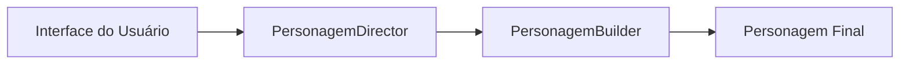

# Aula 11: Aplicando Padrões Criacionais em Projeto 🛠️

## 🎯 Objetivos da Aula
- [x] Praticar a escolha do padrão criacional adequado.
- [x] Refatorar código acoplado usando Abstract Factory.
- [x] Implementar o padrão Builder para objetos altamente configuráveis.
- [x] Identificar padrões criacionais em bibliotecas famosas.

---

## 💡 O Caso: Criador de Avatares (RPG)

Imagine um sistema de criação de personagens onde temos:
- Raças (Humano, Elfo, Orc)
- Classes (Guerreiro, Mago, Arqueiro)
- Equipamentos (Espada, Cajado, Arco)

Tentar criar tudo isso com `if/else` e instanciando classes diretamente gera um código frágil e difícil de expandir.

---

## 📊 Estratégia de Refatoração



---

## 💻 Exemplo: Padrão Builder (Python)

```python
class Personagem:
    def __init__(self):
        self.nome = None
        self.arma = None
        self.armadura = None

class PersonagemBuilder:
    def __init__(self):
        self.p = Personagem()

    def set_nome(self, nome):
        self.p.nome = nome
        return self

    def set_arma(self, arma):
        self.p.arma = arma
        return self

    def build(self):
        return self.p

# Uso fluente
heroi = PersonagemBuilder().set_nome("Aragon").set_arma("Andúril").build()
```

---

## 🧠 Blocos de Destaque

!!! concept "Abstract Factory"
    É uma "fábrica de fábricas". Use-a quando precisar criar famílias de objetos relacionados (ex: Kit UI Dark vs Kit UI Light) sem especificar suas classes concretas.

!!! tip "Dica de Implementação"
    Muitas vezes o **Singleton** e o **Abstract Factory** trabalham juntos, onde a fábrica em si é um Singleton.

---

## 🚀 Mini-projeto: Fábrica de Temas de Interface
Desenvolva um sistema que, baseado em uma configuração, entrega um conjunto de Botões e Menus (Dark ou Light) usando **Abstract Factory**.

---

## 🎯 Próximos Passos

<div class="grid cards" markdown>

-   :material-presentation: **Slides**
    -   [Ver Slides da Aula](../slides/slide-11.md)

-   :material-school: **Quiz**
    -   [Responder Quiz](../quizzes/quiz-11.md)

-   :material-dumbbell: **Exercícios**
    -   [Lista de Exercícios](../exercicios/exercicio-11.md)

-   :material-rocket: **Projeto**
    -   [Detalhamento do Projeto](../projetos/projeto-11.md)

</div>
