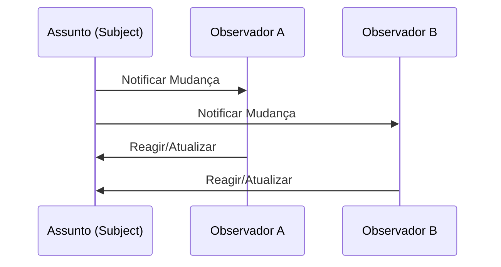

# Aula 13: Padrões Comportamentais 🧠

## 🎯 Objetivos da Aula
- [x] Compreender os padrões Strategy, Observer, Command e Template Method.
- [x] Aprender a encapsular algoritmos trocáveis.
- [x] Implementar comunicação de "um-para-muitos" desacoplada.
- [x] Padronizar passos de um algoritmo mantendo partes flexíveis.

---

## 💡 O que são Padrões Comportamentais?

Eles se preocupam com algoritmos e a atribuição de responsabilidades entre objetos. Eles não descrevem apenas padrões de objetos ou classes, mas também os padrões de **comunicação** entre eles.

---

## 🧱 Destaques Comportamentais

### 1. Strategy (Estratégia) 🎯
Define uma família de algoritmos, encapsula cada um deles e os torna intercambiáveis em tempo de execução.
*Exemplo: Diferentes formas de cálculo de frete ou desconto.*

### 2. Observer (Observador) 🔔
Define uma dependência um-para-muitos entre objetos, de modo que quando um objeto muda de estado, todos os seus dependentes são notificados.
*Exemplo: Newsletter, Notificações de ações na bolsa.*

### 3. Template Method 📝
Define o esqueleto de um algoritmo em uma operação, deixando alguns passos para as subclasses.

---

## 📊 Sequência: Observer



---

## 💻 Exemplo: Strategy em Python

```python
class FreteEstrategia:
    def calcular(self, valor): pass

class FreteExpresso(FreteEstrategia):
    def calcular(self, valor): return valor * 0.1

class FreteNormal(FreteEstrategia):
    def calcular(self, valor): return valor * 0.05

class CalculadoraDeFrete:
    def calcular(self, valor, estrategia):
        return estrategia.calcular(valor)

calc = CalculadoraDeFrete()
print(calc.calcular(100, FreteExpresso()))
```

```termynal-exec
python aula-13-strategy.py
10.0
```

---

## 🧠 Blocos de Destaque

!!! concept "Command"
    Encapsula uma solicitação como um objeto, permitindo parametrizar clientes com diferentes solicitações e suportar operações que podem ser desfeitas (Undo).

!!! tip "Dica"
    O padrão **Strategy** ajuda a eliminar grandes blocos de `if/else` ou `switch` relacionados a regras de negócio que mudam frequentemente.

---

## 🚀 Mini-projeto: Sistema de Eventos
Implemente o padrão **Observer** para um sistema de notícias onde múltiplos assinantes (E-mail, SMS, Webhook) recebem atualizações quando uma nova notícia é publicada.

---

## 🎯 Próximos Passos

<div class="grid cards" markdown>

-   :material-presentation: **Slides**
    -   [Ver Slides da Aula](../slides/slide-13.md)

-   :material-school: **Quiz**
    -   [Responder Quiz](../quizzes/quiz-13.md)

-   :material-dumbbell: **Exercícios**
    -   [Lista de Exercícios](../exercicios/exercicio-13.md)

-   :material-rocket: **Projeto**
    -   [Detalhamento do Projeto](../projetos/projeto-13.md)

</div>
