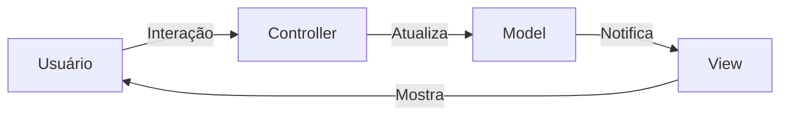

# Aula 14: MVC e Arquitetura 🏛️

## 🎯 Objetivos da Aula
- [x] Compreender o padrão arquitetural MVC (Model-View-Controller).
- [x] Aprender a separar lógica de negócio, interface e controle.
- [x] Ver a aplicação do MVC em sistemas modernos (Web e Desktop).
- [x] Identificar os padrões GoF que compõem o MVC.

---

## 💡 O que é MVC?

O MVC é um padrão de arquitetura de software que divide a aplicação em três componentes interconectados, cada um com uma responsabilidade específica:

1.  **Model (Modelo)**: Gerencia os dados, a lógica de negócio e as regras de persistência.
2.  **View (Visão)**: Responsável pela apresentação visual dos dados ao usuário.
3.  **Controller (Controle)**: Atua como intermediário, recebendo a entrada do usuário e coordenando as ações entre o Model e a View.

---

## 📊 Fluxo MVC



---

## 🧱 Padrões por Trás do MVC

O MVC não é um padrão único, mas uma combinação de vários:
- **Observer**: O Model notifica a View sobre mudanças.
- **Strategy**: O Controller define como a View reage às entradas.
- **Composite**: A View costuma ser uma estrutura composta de widgets.

---

## 👨‍💻 Exemplo Conceitual (Python Simplificado)

```python
class Model:
    def __init__(self):
        self.dados = "Olá MVC"

class View:
    def exibir(self, model):
        print(f"Tela: {model.dados}")

class Controller:
    def __init__(self, model, view):
        self.model = model
        self.view = view

    def mudar_dados(self, novo_texto):
        self.model.dados = novo_texto
        self.view.exibir(self.model)

# Execução
app = Controller(Model(), View())
app.mudar_dados("Nova Mensagem")
```

---

## 🧠 Blocos de Destaque

!!! info "MVC na Web"
    Em frameworks web modernos (como Django, Spring MVC, Rails), o MVC é ligeiramente adaptado, onde a View é frequentemente o HTML/Template e o Model é a camada de dados (ORM).

!!! success "Benefício"
    A principal vantagem do MVC é o **desacoplamento**. Você pode trocar a interface (View) sem precisar mexer na lógica de negócio (Model).

---

## 🚀 Mini-projeto: Task Manager MVC
Vamos esboçar a estrutura de um gerenciador de tarefas simples, separando as classes em pastas `model/`, `view/` e `controller/`.

---

## 🎯 Próximos Passos

<div class="grid cards" markdown>

-   :material-presentation: **Slides**
    -   [Ver Slides da Aula](../slides/slide-14.md)

-   :material-school: **Quiz**
    -   [Responder Quiz](../quizzes/quiz-14.md)

-   :material-dumbbell: **Exercícios**
    -   [Lista de Exercícios](../exercicios/exercicio-14.md)

-   :material-rocket: **Projeto**
    -   [Detalhamento do Projeto](../projetos/projeto-14.md)

</div>
