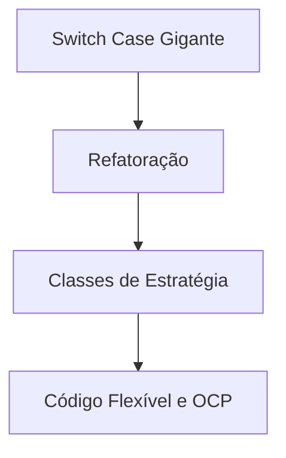

# Aula 15: Refatoração com Padrões ♻️

## 🎯 Objetivos da Aula
- [x] Identificar oportunidades de melhoria em código legado.
- [x] Substituir condicionais complexas por polimorfismo (Strategy).
- [x] Desacoplar sistemas usando Adapter.
- [x] Aplicar o ciclo: Identificar cheiro -> Escolher Padrão -> Refatorar.

---

## 💡 O Poder da Refatoração

Refatorar não é apenas "mudar o nome de variáveis". É alterar a estrutura interna do código para torná-lo mais elegante e sustentável, **sem alterar seu comportamento externo**.

> "Se o código está funcionando, mas é um pesadelo de manter, ele está quebrado conceitualmente."

---

## 📊 De Switch para Strategy



---

## 💻 Caso Real: Processamento de Pagamentos

### Antes (Problemático)
```python
def processar(tipo, valor):
    if tipo == "CC": # Cartão de Crédito
        # Lógica CC
    elif tipo == "PIX":
        # Lógica PIX
    # Difícil de expandir!
```

### Depois (Refatorado com Padrões)
```python
class Pagamento:
    def pagar(self, valor): pass

# Agora cada novo método é uma nova CLASSE, não um novo IF.
class PagamentoPix(Pagamento):
    def pagar(self, valor):
        print(f"Pagando R$ {valor} via Pix")
```

---

## 🧠 Destaques

!!! tip "Regra de Ouro"
    Antes de refatorar, garanta que você tenha **testes automatizados**. Eles são sua rede de proteção para garantir que você não quebrou nada durante a limpeza.

!!! warning "Atenção"
    Cuidado para não "sobrerrefatorar". Às vezes, um `if` simples é melhor do que 10 classes de padrão complexo. Use o bom senso.

---

## 🚀 Mini-projeto: Limpando o Legado
Pegue o seu projeto da Aula 08 (onde você auditou code smells) e agora aplique os padrões aprendidos para resolver pelo menos dois dos problemas identificados.

---

## 🎯 Próximos Passos

<div class="grid cards" markdown>

-   :material-presentation: **Slides**
    -   [Ver Slides da Aula](../slides/slide-15.md)

-   :material-school: **Quiz**
    -   [Responder Quiz](../quizzes/quiz-15.md)

-   :material-dumbbell: **Exercícios**
    -   [Lista de Exercícios](../exercicios/exercicio-15.md)

-   :material-rocket: **Projeto**
    -   [Detalhamento do Projeto](../projetos/projeto-15.md)

</div>
