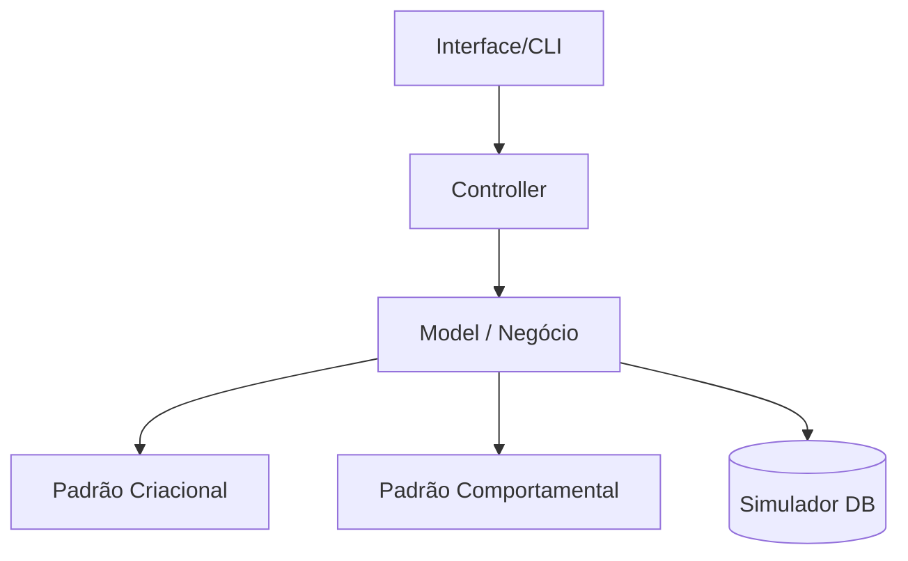

# Aula 16: Desenvolvimento de Mini Projeto 🏆

## 🎯 Objetivos da Aula
- [x] Aplicar os conhecimentos adquiridos em um cenário real.
- [x] Escolher o paradigma mais adequado para diferentes partes do sistema.
- [x] Implementar pelo menos 2 padrões de projeto (GoF).
- [x] Demonstrar princípios de Clean Code e SOLID.

---

## 🚀 O Desafio Final

Você deve desenvolver um **protótipo funcional** (focado na arquitetura) de um dos seguintes sistemas:

1.  **🛒 Sistema de E-commerce**: Com cálculo de frete (Strategy), catálogo (Composite) e log de transações (Singleton).
2.  **🚗 Gestão de Frota/Logística**: Com rastreamento (Observer), criação de veículos (Factory/Builder) e interface simplificada (Facade).

---

## 📋 Requisitos Obrigatórios

-   **Modularidade**: O sistema deve estar dividido em camadas (MVC ou similar).
-   **Padrões**: Implementação clara de no mínimo 2 Design Patterns.
-   **Paradigma**: Uso de POO para a estrutura e pelo menos um trecho usando técnicas Funcionais (Map/Filter).
-   **Documentação**: Um breve arquivo `README.md` explicando as decisões arquiteturais tomadas.

---

## 📊 Arquitetura Sugerida



---

## 💻 Exemplo de Estrutura de Pastas

```termynal-exec
# Estrutura recomendada para o projeto
mkdir meu_projeto
cd meu_projeto
mkdir src tests docs
touch src/main.py src/models.py src/patterns.py
```

---

## 🧠 Dica para a Apresentação

!!! tip "Foco Técnico"
    Não se preocupe com uma interface gráfica bonita. O foco aqui é o **"Motor"** do sistema. Explique por que você escolheu o padrão X em vez do Y.

!!! success "Critério de Sucesso"
    O código deve ser fácil de ler, testar e, acima de tudo, fácil de **estender** para novas funcionalidades.

---

## 🏁 Encerramento do Curso

Parabéns por chegar até aqui! Você agora possui uma base sólida em design de software que o acompanhará por toda a sua carreira.

---

## 🎯 Próximos Passos

<div class="grid cards" markdown>

-   :material-trophy: **Certificação**
    -   [Ver Instruções Finais](../plano-ensino.md)

-   :material-book-open-variant: **Materiais de Apoio**
    -   [Revisar Todos os Padrões](../materiais.md)

</div>
